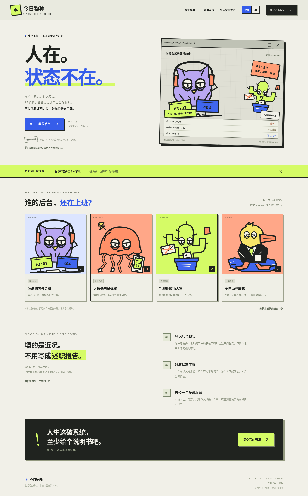

# 今日物种 · Today's Creature

人在，状态不在。回答 12 道生活后台小问题，生成一张荒诞办公室状态工牌：粗线条角色、故障提示、吐槽词条和一个不要求你重装人生的临时处理方案。

面向在读与留学生、上班族、照顾家庭的人、创业者和正在探索下一步的人。玩梗对事不对人；身份选择不参与评分。

第二版采用故障弹窗、工牌和粗黑线撞色视觉。结果吐槽任务、内耗和无限响应要求，减少泛泛的励志话；评分仍沿用透明规则，8 个角色 ID 保持兼容旧分享链接。

支持中文和英文：页面、题目、角色结果和导出的 PNG 都可随语言切换。答题、匹配和导出在浏览器本地完成，不调用翻译或 OpenAI API，访问者不会消耗你的 API 额度。



[查看状态工牌样例](docs/status-card.png)

[查看英文首页](docs/preview-en.png) · [查看英文工牌](docs/status-card-en.png)

## 它在测什么

观察**最近两周**的精力余量、压力负荷、方向清晰度和支持感，各 3 道题。每题按 0–3 分映射，每维总分除以 9，转成 0–100 的倾向值。压力分越高表示负荷越大，其余维度越高表示相应资源越充足。

匹配采用透明的规则和固定优先顺序，代码与解释位于 `src/scoring.js`。8 种角色都能由有效回答匹配到，结果页展示匹配理由。

**这是原创的状态小游戏，未经临床或心理量表验证，不是 MBTI 人格测试，也不用于心理诊断、职业预测或给人贴永久标签。**不同时间可以得到不同结果。

## 中文和英文

页面提供 **中文 / EN** 手动切换，答题途中切换会保留当前答案与进度。导出的 PNG 使用当前语言；分享链接同时携带角色 `r` 和语言 `lang`，例如 `?r=night-owl&lang=en`，朋友打开时会看到对应语言的分享卡。

第一次打开时，语言按以下顺序选择：有效的 URL `lang=zh` 或 `lang=en` → 浏览器本地保存的语言偏好 → 浏览器语言。中文浏览器默认中文，其他语言默认英文；任何时候都可以手动更换。

Chinese and English are available throughout the quiz and results. Switch languages without losing your answers. Share links and exported PNG cards use your selected language. Everything runs locally in your browser, with no AI API calls.

## 本地运行

建议使用 Node.js 22 或更新版本，以及 npm。

```bash
npm ci
npm run dev
```

开发服务默认在 `http://localhost:5173`。其他常用命令：

```bash
npm test          # Node 内置测试：评分、规则优先级、输入校验和纯函数行为
npm run build    # 生成 dist/
npm run preview  # 本地预览构建产物，默认 http://localhost:4173
npm run package:site # 构建并生成不含个人标识的直接上传 ZIP
```

测试脚本不需要外部服务。浏览器交互包括答题、返回修改、继续标签页草稿、结果说明、完整图鉴、复制分享链接及 PNG 状态卡导出。PNG 在浏览器本地绘制，不调用图片生成 API。

## 隐私与密钥

- 不需要注册，也不使用 AI API、后端、分析埋点或密钥。
- 回答草稿仅保存在当前标签页的 `sessionStorage` 中，用于中途继续；生成结果后删除。回答不上传服务器。
- 分享链接中的 `r` 和 `lang` 只包含物种标识与显示语言，不包含私人回答、身份选择或维度数据。打开链接看到的是分享卡，不会被当成自己的测试结果。
- 手动选择的语言偏好只保存在当前浏览器，不上传服务器。
- PNG 状态卡使用当前语言，仅包含物种画像和文案，不包含逐题回答。
- `.gitignore` 忽略 `.env` 和 `.env.*`，以及依赖、构建产物和本地缓存；仅允许不含秘密的 `.env.example` 模板入库。当前版本无需创建 `.env`。

以后如需接入真实 API，密钥应仅放在**服务器端**的 `.env`，由后端读取。不要硬编码、提交或发到聊天中；不要使用 `VITE_` 前缀保存密钥，因为 Vite 会把这类变量打包到公开的前端代码里。

## 源码结构

```text
src/
  App.jsx          首页、答题、结果、分享与本地 PNG 导出
  Creature.jsx     8 种原创 SVG 小物种
  cardExport.js    本地绘制故障工牌 PNG
  content.js       题目、身份选项和角色文案
  content.en.js    对应英文题目与角色，保持相同 ID 和计分
  i18n.js          界面文案、语言选择和干净的分享地址
  scoring.js       透明的评分与匹配规则
  styles.css       页面样式、移动端适配
  main.jsx         React 入口
tests/
  scoring.test.js  评分与输入校验测试
  i18n.test.js     双语内容一致性、语言优先级和分享隐私
vite.config.js     Vite 配置，相对资源路径
```

## 部署

不用写代码也能上线，首次只需 5 步：

1. 下载本次交付的 `todays-creature-site.zip` 到电脑，保持 ZIP 不解压。
2. 登录 [Cloudflare Dashboard](https://dash.cloudflare.com/)，没有账号时注册免费账号。
3. 打开 **Workers & Pages**，创建 **Pages** 应用，选择 **Direct Upload / Upload assets**。
4. 填写不含姓名的中性项目名；可用名称以平台实际提示为准。
5. 上传 ZIP，点击 **Deploy site**；等部署完成后打开并分享平台实际返回的 `pages.dev` 地址。

当前云环境无法代替你登录 Cloudflare；账号登录和最后的上传需在你的浏览器完成。本仓库并不代表网站已经匿名上线。

若分享网址不能出现 GitHub 用户名，优先使用免费的 Cloudflare Pages Direct Upload，见[匿名网址发布步骤](docs/anonymous-hosting.md)。执行 `npm run package:site` 会生成 `/tmp/todays-creature-site.zip`；打包前检查构建文件中的姓名、仓库地址、邮箱和密钥特征。ZIP 仅包含公开网页文件，不包含 Git 历史或逐题答案。ZIP 打包需要 Python 3；当前云环境已提供。

上传 ZIP 需要在你自己的 Cloudflare 账号中创建一个中性名称的 Pages 项目。实际 `pages.dev` 地址以平台分配为准；没有进行这一步时，原 GitHub Pages 地址仍含用户名。

执行 `npm ci && npm run build`，把生成的 `dist/` 发布到支持静态站点的服务即可。不需要服务器运行时或环境密钥。

### GitHub Pages：第一次开启

GitHub 代码分支链接只能查看源码。要实际打开网站，先将网页发布到 `gh-pages` 分支，再开启仓库的 Pages：

1. 从已提交的功能分支执行 `npm run publish:pages`。它会测试、构建，并把静态网页推送到独立的 `gh-pages` 发布分支，不修改 `main`，不把 `dist/` 提交到源码分支。
2. 打开[仓库 Pages 设置](https://github.com/Ida-Wang117/AI-Project-by-my-own/settings/pages)。
3. 在 **Build and deployment** 中，**Source** 选择 **Deploy from a branch**；**Branch** 选择 **gh-pages**，目录选择 **/ (root)**，点击 **Save**。
4. 等待 GitHub 的 Pages 发布完成，以设置页显示的 **Visit site** 地址为准。发布完成前，网站地址可能仍返回 404。

后续在新功能分支提交代码，再运行 `npm run publish:pages` 即可刷新网站。发布脚本保留 `gh-pages` 历史，不强制推送；如果发现其他站点已经使用这个发布分支，会停止而不覆盖。该分支只放公开网页文件，不包含回答、密钥或 `node_modules`。

`vite.config.js` 使用 `base: './'`，以便资源路径适配仓库子目录；如改为固定部署路径，请相应调整 `base`。此项目通过查询参数分享结果，无需配置客户端路由回退。

**将代码提交到 GitHub 与网站上线是两步不同的操作。**推送分支只保存源码；上线还需要配置静态托管和执行发布。本 README 不代表站点已经部署。

## 协作约定

每次生成或修改代码时，先创建一个新分支，再提交并推送；不直接修改或提交到 `main`。例如：

```bash
git switch -c feat/your-change
# 完成修改和适当验证后，按需添加明确的源码文件
git add <changed-source-files>
git commit -m "Describe the change"
git push -u origin feat/your-change
```

提交前检查 `git status` 与暂存差异，遵循 `.gitignore`，不提交密钥、`node_modules/`、`dist/` 或本地草稿。通过分支或 Pull Request 审阅后再决定是否合并。
